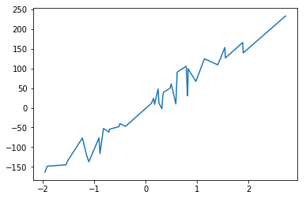
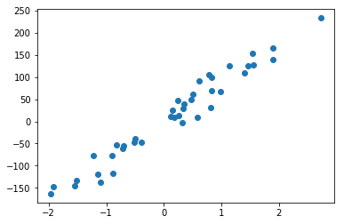
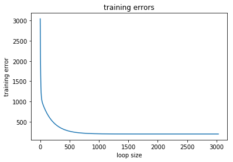
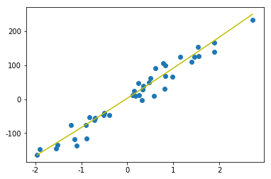

线性回归--个人理解整理


```python
import matplotlib.pyplot as plt
import numpy as np
from sklearn.datasets import make_regression
%matplotlib inline
```


```python
# 原始数据准备
X, y = make_regression(n_samples=200, n_features=1, noise=20, random_state=42)
```


```python
def shuffle_data(X, y, seed=None):
    """对数据进行重新排列
    
    X:输入数据
    y:输出数据
    seed: 随机种子
    """
    n_samples, n_features = np.shape(X)
    if seed:
        np.random.seed(seed)
        
    new_index = np.arange(n_samples)
    np.random.shuffle(new_index)
    
    return X[new_index], y[new_index]
```


```python
a = np.arange(16).reshape((4, 4))
a
```


    array([[ 0,  1,  2,  3],
           [ 4,  5,  6,  7],
           [ 8,  9, 10, 11],
           [12, 13, 14, 15]])


```python
b = np.arange(4)
b
```


    array([0, 1, 2, 3])


```python
shuffle_data(a, b)
```


    (array([[ 8,  9, 10, 11],
            [ 4,  5,  6,  7],
            [12, 13, 14, 15],
            [ 0,  1,  2,  3]]), array([2, 1, 3, 0]))


```python
shuffle_data(a, b)
```


    (array([[ 0,  1,  2,  3],
            [12, 13, 14, 15],
            [ 4,  5,  6,  7],
            [ 8,  9, 10, 11]]), array([0, 3, 1, 2]))


```python
def train_test_split(X, y, test_size, shuffle=True, seed=None):
    """按比例拆分训练集与数据集
    
    X:输入数据
    y:输出数据
    test_size:测试集比例
    shuffle:是否重新排列数据 True, False
    seed:随机数种子
    """
    
    if shuffle:
        X, y = shuffle_data(X, y, seed=seed)
        
    n_samples, n_features = np.shape(X)
    split_index = n_samples - int(n_samples * test_size)
    
    X_train, X_test = X[:split_index], X[split_index:]
    y_train, y_test = y[:split_index], y[split_index:]
    
    return np.array(X_train), np.array(X_test), np.array(y_train), np.array(y_test)
```


```python
train_test_split(a, b, test_size=0.5)
```


    (array([[ 8,  9, 10, 11],
            [ 4,  5,  6,  7]]), array([[12, 13, 14, 15],
            [ 0,  1,  2,  3]]), array([2, 1]), array([3, 0]))


```python
X_train, X_test, y_train, y_test = train_test_split(X, y, test_size=0.2, seed=123)
```


```python
# 对test数据做排序，用于后边图形展示
sorted_data = sorted([(X_test[i][0], y_test[i]) for i in range(X_test.shape[0])])
sorted_data
```


    [(-1.9596701238797756, -163.09469931804895),
     (-1.913280244657798, -148.10200436136597),
     (-1.5506634310661327, -144.71710194213483),
     (-1.5148472246858646, -134.01831546837096),
     (-1.2308643164339552, -76.59207503276278),
     (-1.1509935774223028, -118.84748255181975),
     (-1.1063349740060282, -136.96608290365333),
     (-0.9080240755212109, -76.36713129027189),
     (-0.8895144296255233, -116.29773110576323),
     (-0.8206823183517105, -52.47827414329759),
     (-0.7143514180263678, -61.588258248217116),
     (-0.7020530938773524, -54.35596972432038),
     (-0.5182702182736474, -47.64159112082246),
     (-0.5017570435845365, -39.870846643410985),
     (-0.39210815313215763, -46.99653062945809),
     (0.11092258970986608, 11.336023578811233),
     (0.1537251059455279, 24.197263043091915),
     (0.173180925851182, 8.93395392700909),
     (0.24196227156603412, 47.84674470889746),
     (0.25755039072276437, 12.133015876725498),
     (0.3142473325952739, -2.444153109715348),
     (0.33126343140356396, 28.675318624803083),
     (0.3464482094969757, 39.54996207160692),
     (0.4738329209117875, 49.69735824109566),
     (0.4967141530112327, 61.029305382964836),
     (0.5868570938002703, 9.688906144419953),
     (0.6116762888408679, 90.54114641161729),
     (0.787084603742452, 105.37843947014757),
     (0.8135172173696698, 30.634291307548168),
     (0.82206015999449, 68.97086562331316),
     (0.822544912103189, 99.43658545210259),
     (0.9755451271223592, 66.93986936754759),
     (1.1428228145150205, 124.36665477961104),
     (1.4027943109360992, 109.09446382506813),
     (1.4535340771573169, 124.88317696389883),
     (1.5380365664659692, 153.13795020497358),
     (1.5499344050175394, 126.43943641020023),
     (1.8861859012105302, 165.73180201869272),
     (1.8967929826539474, 139.31834948988964),
     (2.720169166589619, 233.0158940056998)]


```python
X_test = np.array([[sorted_data[i][0]] for i in range(len(sorted_data))])
X_test
```


    array([[-1.95967012],
           [-1.91328024],
           [-1.55066343],
           [-1.51484722],
           [-1.23086432],
           [-1.15099358],
           [-1.10633497],
           [-0.90802408],
           [-0.88951443],
           [-0.82068232],
           [-0.71435142],
           [-0.70205309],
           [-0.51827022],
           [-0.50175704],
           [-0.39210815],
           [ 0.11092259],
           [ 0.15372511],
           [ 0.17318093],
           [ 0.24196227],
           [ 0.25755039],
           [ 0.31424733],
           [ 0.33126343],
           [ 0.34644821],
           [ 0.47383292],
           [ 0.49671415],
           [ 0.58685709],
           [ 0.61167629],
           [ 0.7870846 ],
           [ 0.81351722],
           [ 0.82206016],
           [ 0.82254491],
           [ 0.97554513],
           [ 1.14282281],
           [ 1.40279431],
           [ 1.45353408],
           [ 1.53803657],
           [ 1.54993441],
           [ 1.8861859 ],
           [ 1.89679298],
           [ 2.72016917]])


```python
y_test = np.array([sorted_data[i][1] for i in range(len(sorted_data))])
y_test
```


    array([-163.09469932, -148.10200436, -144.71710194, -134.01831547,
            -76.59207503, -118.84748255, -136.9660829 ,  -76.36713129,
           -116.29773111,  -52.47827414,  -61.58825825,  -54.35596972,
            -47.64159112,  -39.87084664,  -46.99653063,   11.33602358,
             24.19726304,    8.93395393,   47.84674471,   12.13301588,
             -2.44415311,   28.67531862,   39.54996207,   49.69735824,
             61.02930538,    9.68890614,   90.54114641,  105.37843947,
             30.63429131,   68.97086562,   99.43658545,   66.93986937,
            124.36665478,  109.09446383,  124.88317696,  153.1379502 ,
            126.43943641,  165.73180202,  139.31834949,  233.01589401])


```python
plt.plot(X_test, y_test)
```


    [<matplotlib.lines.Line2D at 0x1a20462c88>]





```python
plt.scatter(X_test, y_test)
```


    <matplotlib.collections.PathCollection at 0x1a20f0cac8>





$$MSE = \frac{1}{2m}\sum_{i = 0}^m(y_pred - y)^2 + penalty$$
$$MSE' = \frac{1}{m}(0.5 * (y_pred - y) * X + penalty'$$
$$L1_penalty = \alpha * ||w_i|| \quad i>0$$
$$L1_penalty' = \alpha * np.sign(w)$$
$$L2_penalty = \alpha * 0.5 *||w_i||^2 \quad i>0$$
$$L2_penalty' = \alpha * 0.5 * w * w.T$$


```python
class l1_function():
    """L1正则化
    
    去除w0
    å: 惩罚参数
    """
    def __init__(self, alpha=0.01):
        self.alpha = alpha
    
    def __call__(self, w):
        w = w[1:]
        return self.alpha * np.linalg.norm(w, ord=1)
    
    def gradient(self, w):
        w = w[1:]
        return self.alpha * np.sign(w)
```


```python
l1 = l1_function(0.01)
```


```python
l1([-0.3, 0.4])
```


    0.004


```python
class l2_function():
    """l2正则化
    
    去除w0
    å: 惩罚参数
    """
    def __init__(self, alpha=0.01):
        self.alpha = alpha
        
    def __call__(self, w):
        w = w[1:]
        return self.alpha * 0.5 * w.T.dot(w)
    
    def gradient(self, w):
        w = w[1:]
        return self.alpha * w
```


```python
class l1_l2_function():
    """ElasticNet 正则化
    
    去除w0
    å: 惩罚参数
    l1_ratio: l1比例
    """
    def __init__(self, alpha=0.01, l1_ratio=0.5):
        self.alpha = alpha
        self.l1_ratio = l1_ratio
        
    def __call__(self, w):
        w = w[1:]
        l1_loss = self.l1_ratio * np.linalg.norm(w, ord=1)
        l2_loss = (1 - self.l1_ratio) * 0.5 * w.T.dot(w)
        return self.alpha * (l1_loss + l2_loss)
    
    def gradient(self, w):
        w = w[1:]
        l1_gradient = self.l1_ratio * np.sign(w)
        l2_gradient = (1 - self.l1_ratio) * w
        return self.alpha * (l1_gradient + l2_gradient)
```


```python
# 数据归一化
def normalize(X, axis=1, ord=2):
    norm = np.linalg.norm(X, axis=axis, ord=ord)
    #去除值为0，防止除0异常
    norm[norm == 0] = 1
    return X / np.expand_dims(norm, axis=axis)
```


```python
from sklearn.preprocessing import PolynomialFeatures
```


```python
X = np.arange(6).reshape(3, 2)
X
```


    array([[0, 1],
           [2, 3],
           [4, 5]])


```python
poly = PolynomialFeatures(degree=2)
```


```python
poly.fit_transform(X)
```


    array([[ 1.,  0.,  1.,  0.,  0.,  1.],
           [ 1.,  2.,  3.,  4.,  6.,  9.],
           [ 1.,  4.,  5., 16., 20., 25.]])


```python
from itertools import combinations_with_replacement
```


```python
comb = combinations_with_replacement('01',0)
```


```python
[c for c in comb]
```


    [()]


```python
def poly_features(X, degree):
    from itertools import combinations_with_replacement
    
    n_samples, n_features = np.shape(X)
    
    def make_poly():
        combs = [combinations_with_replacement(range(n_features), i) for i in range(1, degree + 1)]
        new_combs = [item for sub in combs for item in sub]
        return new_combs
     
    combs = make_poly()
    print('combs', combs)
    new_features_length = len(combs)
    new_X = np.empty((n_samples, new_features_length))
    
    for i, index_combs in enumerate(combs):
        new_X[:, i] = np.prod(X[:, index_combs], axis=1)
        
    new_X = np.insert(new_X, 0, 1, axis=1)
        
    return new_X
```


```python
p = np.arange(9).reshape(3, 3)
p
```


    array([[0, 1, 2],
           [3, 4, 5],
           [6, 7, 8]])


```python
poly_features(p, 2)
```

    combs [(0,), (1,), (2,), (0, 0), (0, 1), (0, 2), (1, 1), (1, 2), (2, 2)]


    array([[ 1.,  0.,  1.,  2.,  0.,  0.,  0.,  1.,  2.,  4.],
           [ 1.,  3.,  4.,  5.,  9., 12., 15., 16., 20., 25.],
           [ 1.,  6.,  7.,  8., 36., 42., 48., 49., 56., 64.]])


```python
class LinearRegression():
    """线性回归
    
    kernel: lasso ridge elastic
    learning_rate: 学习率
    alpha: 正则化惩罚参数
    l1_ratio: ElasticNet正则化l1比例
    normalized: True, False 归一化
    polynomial: True, False 多项式处理
    degree: 阶数
    eth: 停止迭代
    """
    
    def __init__(self, kernel=None, learning_rate=0.01, alpha=10, l1_ratio=0.5, normalized=False, polynomial=False, degree=1, eth=0.0001):
        self.kernel = kernel
        self.learning_rate = learning_rate
        self.normalized = normalized
        self.polynomial = polynomial
        self.degree = degree
        self.eth = eth
        
        if self.kernel == 'ridge':
            self.regularization = l2_function(alpha=alpha)
        elif self.kernel == 'lasso':
            self.regularization = l1_function(alpha=alpha)
        elif self.kernel == 'elastic':
            self.regularization = l1_l2_function(alpha=alpha, l1_ratio=l1_ratio)
        else:
            self.regularization = lambda x: 0
            self.regularization.gradient = lambda x: 0
        
    def _initial_weights(self, feature_length):
        """初始化权重系数"""
        limit = 1 / np.sqrt(feature_length)
        self.w = np.random.uniform(-limit, limit, (feature_length, ))
        
        
    def fit(self, X, y):
        if self.polynomial:
            X = poly_features(X, degree=self.degree)
        
        if self.normalized:
            X = normalize(X)
            
        # 构造X = 1, 构造偏置
        X = np.insert(X, 0, 1, axis=1)
        
        self.training_error = []  # 记录每一步的训练误差
        self._initial_weights(np.shape(X)[1])
        
        while True:
            y_pred = X.dot(self.w)
            
            mse = np.mean(0.5 * (y_pred - y) ** 2 + self.regularization(self.w))
            self.training_error.append(mse)
            
            g_w = (y_pred - y).T.dot(X) / len(X) + self.regularization.gradient(self.w)
#             g_w = ((y_pred - y).T.dot(X) + self.regularization.gradient(self.w))
#             if np.abs(g_w) < self.eth:
#                 break
                
            l_w = self.w
            w_t = self.w - self.learning_rate * g_w
            tmp = l_w - w_t
            self.w = w_t
            if (np.sum(np.abs(tmp)) < self.eth):
                break
            
    def predict(self, X):
        if self.polynomial:
            X = poly_features(X, degree=self.degree)
        
        if self.normalized:
            X = normalize(X)
            
        # 构造X = 1, 构造偏置
        X = np.insert(X, 0, 1, axis=1)
        return X.dot(self.w)
```


```python
model = LinearRegression(polynomial=True, degree=3)
```


```python
model.fit(X_train, y_train)
```

    combs [(0,), (0, 0), (0, 0, 0)]


```python
y_pred = model.predict(X_test)
```

    combs [(0,), (0, 0), (0, 0, 0)]


```python
plt.plot(range(len(model.training_error)), model.training_error)
plt.title('training errors')
plt.xlabel('loop size')
plt.ylabel('training error')
```


    Text(0, 0.5, 'training error')





```python
plt.scatter(X_test, y_test)
plt.plot(X_test, y_pred, 'y')
```


    [<matplotlib.lines.Line2D at 0x1c2d12fd68>]




